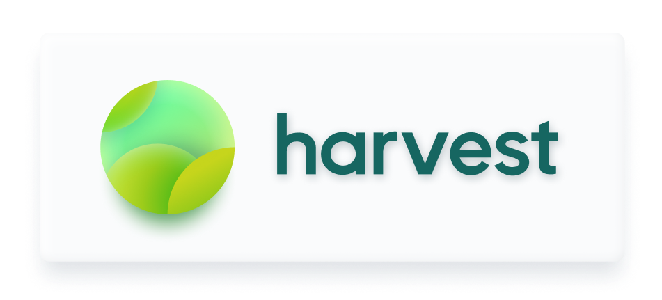

Harvest is a Python based framework providing a simple and intuitive framework for algorithmic trading. Visit Harvest's [**website**](https://tfukaza.github.io/harvest/) for details, tutorials, and documentation. 

<br />


[](https://codecov.io/gh/tfukaza/harvest)


---

**⚠️WARNING⚠️**
Harvest is currently at **v0.1**. The program is unstable and cointains many bugs. Use with caution, and contributions are greatly appreciated. 
- 🪲 [File a bug report](https://github.com/tfukaza/harvest/issues/new?assignees=&labels=bug&template=bug_report.md&title=%5B%F0%9F%AA%B0BUG%5D)
- 💡 [Submit a feature suggestion](https://github.com/tfukaza/harvest/issues/new?assignees=&labels=enhancement%2C+question&template=feature-request.md&title=%5B%F0%9F%92%A1Feature+Request%5D)
- 📝 [Request documentation](https://github.com/tfukaza/harvest/issues/new?assignees=&labels=documentation&template=documentation.md&title=%5B%F0%9F%93%9DDocumentation%5D)

# Example
Below is a minimal example of a crossover strategy for `TWTR` implemented with Harvest, tested on historical stock prices.
```python
from harvest.algo import *
from harvest.trader import *
from harvest.api import *

class Watch(algo.BaseAlgo):
    def main(self):
        sma_long = self.sma(period=50)
        sma_short = self.sma(period=20)
        if self.crossover(sma_long, sma_short):
            self.buy()
        elif self.crossover(sma_short, sma_long):
            self.sell()

if __name__ == "__main__":
    t = tester.BackTester()
    t.set_symbol('TWTR')
    t.set_algo(Watch())
    t.start()
```
If you want to see how this algorithm performs in real life, just change one line to enable paper trading:
```diff
- t = tester.BackTester()
+ t = trader.Trader()
```
Confident in your strategy? Deploy it using a broker of your choice (Currently only supports Robinhood). Again, you just need to change one line:
```diff
- t = trader.Trader()
+ t = trader.Trader(robinhood.Robinhood())
```
With Harvest, the process of testing, simulating, and deploying your strategies is a piece of cake 🍰

# Installation
There are few prerequisites:
- git
- **Python 3.8+**
- pip

Harvest is still early in development, so you'll have to install it directly from this repo. 
```bash
pip install -e 'git+https://github.com/tfukaza/harvest.git#egg=harvest'
```
Next, install the dependencies necessary for the brokerage of your choice. Currently, Harvest only supports Robinhood. 
```bash
pip install -e 'git+https://github.com/tfukaza/harvest.git#egg=harvest[Robinhood]'
```
Now you're all set!

# Contributing
Contributions are greatly appreciated. Check out the [CONTRIBUTING](CONTRIBUTING.md) document for details.

# Disclaimer
- Harvest is not officially associated with Robinhood LLC.  
    - Robinhood was also not designed to be used for algo-trading. Excessive access to their API can result in your account getting locked. 
- Tutorials and documentation solely exist to provide technical references of the code. They are not recommendations of any specific securities or strategies. 
- Use Harvest at your own responsibility. Developers of Harvest take no responsibility for any financial losses you incur by using Harvest.  
