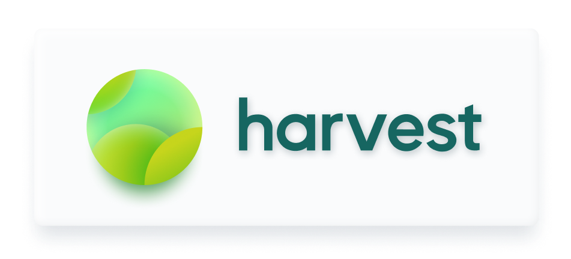

<br />
Harvest is a Python framework for algorithmic trading that is being refactored toward a service-oriented, event-driven architecture. Broker integrations, storage backends, event transport, and algorithm abstractions remain the foundation while the legacy trader runtime is being removed. Visit [**here**](https://tfukaza.github.io/harvest-website) for tutorials and documentation.

<br />


[](https://codecov.io/gh/tfukaza/harvest)

[](https://github.com/psf/black)
---

**⚠️WARNING⚠️**
Harvest is currently at **v0.3**. The program is unstable and contains many bugs. Use with caution, and contributions are greatly appreciated.
- 🪲 [File a bug report](https://github.com/tfukaza/harvest/issues/new?assignees=&labels=bug&template=bug_report.md&title=%5B%F0%9F%AA%B0BUG%5D)
- 💡 [Submit a feature suggestion](https://github.com/tfukaza/harvest/issues/new?assignees=&labels=enhancement%2C+question&template=feature-request.md&title=%5B%F0%9F%92%A1Feature+Request%5D)
- 📝 [Request documentation](https://github.com/tfukaza/harvest/issues/new?assignees=&labels=documentation&template=documentation.md&title=%5B%F0%9F%93%9DDocumentation%5D)

# Current Direction

Harvest no longer treats the legacy `BrokerHub` trader path as a supported runtime. The current supported direction is the orchestrator and service architecture documented in `docs/architecture.md` and demonstrated in `examples/orchestrator_example.py`.

To explore the current runtime direction locally, run:

```bash
uv run python examples/orchestrator_example.py
```

The CLI entrypoint is still present for utility workflows, but the old `harvest start` runtime path has been removed as part of the refactor.

The first Phase 4 proof-of-concept agent is available from the CLI. Add `ANTHROPIC_API_KEY` to a local `.env` file at the repo root, then run:

```bash
uv run harvest agent
```

The default model for this CLI slice is `anthropic/claude-sonnet-4-20250514`. If you override it with `--model` or `HARVEST_AGENT_MODEL`, keep it on a Claude 4 model.

For a single prompt instead of an interactive session, use:

```bash
uv run harvest agent --message "Summarize the current runtime direction."
```

# Installation
The only requirement is to have **Python 3.12 or newer**.

Once you're ready, install [uv](https://docs.astral.sh/uv/). If you want the Harvest CLI available on your machine, install it with:
```bash
uv tool install harvest-python
```

If you are adding Harvest to another Python project, use:
```bash
uv add harvest-python
```

Next, install the dependencies necessary for the brokerage of your choice:
```bash
uv add 'harvest-python[BROKER]'
```
Replace `BROKER` with a brokerage/data source of your choice in lowercase:
- Robinhood
- Alpaca
- Webull
- Kraken
- Polygon

If you installed Harvest as a tool, the CLI is available directly:

```bash
harvest --help
```

If you added Harvest to a project, run commands with `uv run`, for example:

```bash
uv run harvest --help
```

For runtime development during the refactor, prefer the orchestrator examples and architecture docs over the legacy CLI startup flow.

# Contributing
Contributions are greatly appreciated. Check out the [CONTRIBUTING](CONTRIBUTING.md) document for details, and [ABOUT](ABOUT.md) for the long-term goals of this project.

# Disclaimer
- Harvest is not officially associated with Robinhood, Alpaca, Webull, Kraken, Polygon, or Yahoo.
- Many of the brokers were also not designed to be used for algo-trading. Excessive access to their API can result in your account getting locked.
- Tutorials and documentation solely exist to provide technical references of the code. They are not recommendations of any specific securities or strategies.
- Use Harvest at your own responsibility. Developers of Harvest take no responsibility for any financial losses you incur by using Harvest. By using Harvest, you certify you understand that Harvest is a software in early development and may contain bugs and unexpected behaviors.

# Linter
- Trunk is a wrapper around linters. see `trunk.yaml` for details on which linters are enabled
- Currently we run `ruff` which supports isort, pylint, black
- For the best experience, please install the proper extensions under vscode "recommended extensions"
- To run lint checks manually, use `trunk check`, to run formatters, use `trunk fmt`
- To run lint & format checks automatically, install the extensions recommended and save

[^1]: What assets you can trade depends on the broker you are using.
[^2]: Some historical documentation and examples may still reference removed legacy flows while the Phase 3 cleanup is in progress.
