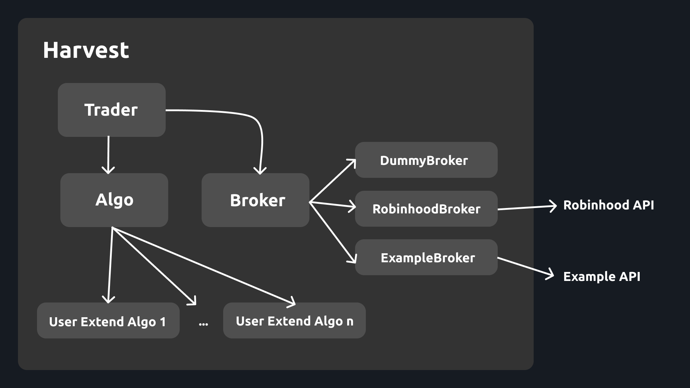

## For Developers
To install dependencies
```
python setup.py install
```
To build
```
python setup.py build
```
To run tests:
```
python -m unittest discover -s test
```

### Harvest architecture


### Harvest Flow on Trader `run()`
