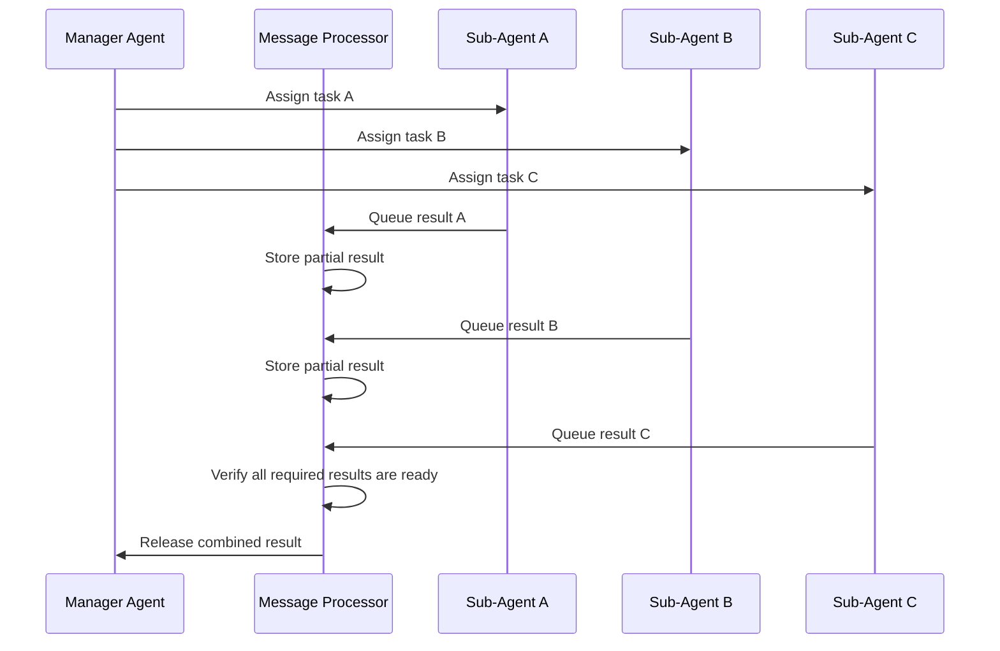
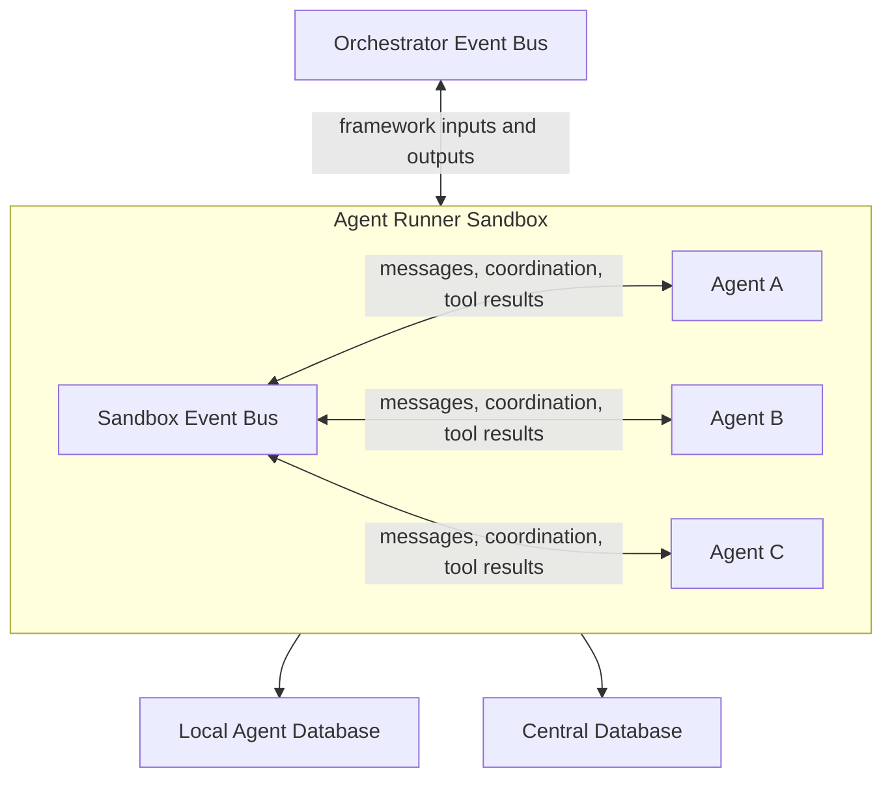

# Agent Runner

## Purpose

The `Agent Runner` is the sandbox boundary for one or more agents.

At the framework level, it plays the same broad role as an `Algorithm`: it receives an input, processes it, and emits a decision. The difference is that an `Algorithm` runs deterministic strategy logic, while an `Agent Runner` hosts agent-driven logic inside a sandbox.

The runner is not the unit of thinking. The agent is. The runner provides the environment in which agents can run, communicate, persist local state, and expose framework-visible decisions.

## Sandbox Model

An `Agent Runner` owns a local execution environment. Inside that sandbox:

- one or more agents may be hosted
- agents may exchange messages
- tool calls may be coordinated
- local reasoning and session state may be stored
- sandbox-local events may be exchanged without routing everything through the orchestrator event bus

## Sandbox Event Bus

An `Agent Runner` may contain its own sandbox-local event bus.

This is distinct from the orchestrator-managed event bus:

- the orchestrator event bus is the system-level transport backbone
- the sandbox event bus is local to a single agent runner sandbox
- sandbox buses are more ephemeral and easier to create or tear down
- sandbox buses may be created by developers and, in later phases, by agents themselves
- sandbox messages are isolated from the orchestrator bus by default

Conceptually, it is still an event bus. Behaviorally, it is closer to a local collaboration fabric for agents in one sandbox.

Sandbox-local communication should not leak onto the orchestrator event bus unless the runner explicitly promotes it to a system-level event. In practice, that should be reserved for important framework-visible outcomes such as final decisions, failures, or other significant runtime events.

That model should support future features such as:

- agent-to-agent messaging
- temporary collaboration spaces
- group-chat style coordination
- local tool-result broadcasts

## Messaging Model

The sandbox messaging model should be flexible rather than hard-wired to one predefined queue shape.

In practice, messaging should look more like an AI-agent version of Slack:

- an agent can send a direct message to a specific agent
- an agent can send a message to a runtime-defined group chat
- a group chat can be created or removed at runtime
- each recipient in a group chat receives the message according to its configured delivery mode

The simplest way to express this is through tools exposed by the runner. For example, an agent might call tools that conceptually behave like:

- `send_message(recipient, content)`
- `create_group_chat(name, members)`
- `read_messages()`

The exact tool names are less important than the model: messaging is an explicit runtime capability, not an implicit side effect hidden inside the agent loop.

Agents, group chats, and message processors should all be treated as first-class endpoints inside the sandbox address space.

## Delivery Modes

How an agent receives messages should be configurable.

Two useful baseline modes are:

- `push` mode: pending messages are inserted into the agent-facing context on the next loop iteration
- `pull` mode: the agent is only notified that messages are waiting and must explicitly call a tool to read them

The `pull` mode matters because an agent may not want to interrupt its current reasoning chain immediately. In some cases, it is better for the agent to defer reading until it reaches a natural checkpoint.

Not all agents need to have an inbox in every mode. Some delivery modes may maintain an inbox explicitly, while others may inject or expose messages without a persistent inbox abstraction.

This means the runner should support at least three distinct concerns:

- message transport
- message visibility policy
- message retrieval policy

Those should be configurable by the sandbox rather than baked into a single rigid messaging behavior.

## Message Processors

Not all sandbox messages need to be forwarded immediately.

By default, a message sent through the sandbox bus can behave like a DM or group-chat message and be delivered right away. But some coordination patterns need a staging step.

A `Message Processor` is an optional sandbox-local component that sits between senders and recipients. Its job is to decide when a message should actually be released.

Examples:

- wait until several agents have each produced their part of a response
- aggregate multiple messages into one outgoing message
- hold a message until a required dependency or tool result is available
- enforce simple coordination rules inside a group workflow

Humans do this kind of coordination manually. In an agent sandbox, it can be part of the runtime model.

This means the sandbox should support both:

- direct message delivery for simple interactions
- processor-mediated delivery for coordinated or delayed interactions

Message processors are first-class sandbox components. They can be created or removed by deterministic runtime configuration, and later phases may also allow agents to create them dynamically when needed.

## Dynamic Topology

The sandbox topology should be mutable at runtime.

In particular:

- agents can be instantiated while the runner is already active
- agents can be removed without tearing down the whole sandbox
- message processors can be attached when a coordination pattern is needed
- message processors can be removed once that coordination pattern is no longer needed
- agents may create new communication structures such as message processors when the sandbox policy allows it

This should be treated as a core runtime requirement, not just an implementation detail. The runner should be able to change its internal communication graph while it is live.

### Message Processor Example

The following example shows a manager agent delegating work to multiple sub-agents and receiving a combined result only after all required sub-agents are ready.

Without a processor, the manager has to keep checking whether each sub-agent is done. With a processor, the coordination rule lives in one place: queue the messages, wait until all required inputs arrive, then release the result.

## Agent Runner Diagram

## Persistence Model

The `Agent Runner` interacts with two persistence scopes:

- `Central Database` for shared market data, transactions, and framework-visible artifacts
- `Local Agent Database` for agent-specific reasoning history, session state, tool-call results, and other sandbox-local records

The placement rule is primarily determined by who generated the record and where it makes sense contextually.

- system-level outcomes such as framework-visible decisions, broker-facing actions, and shared transaction history belong in the `Central Database`
- agent-specific cognition such as reasoning history, local session state, and sandbox-local coordination records belong in the `Local Agent Database`

This keeps shared system records centralized while preserving sandbox-local traceability.

## Lifecycle Expectations

An `Agent Runner` sandbox should be easy to:

- create
- tear down
- isolate
- inspect
- replay using persisted local and central records

Within a running sandbox, it should also be easy to:

- add an agent
- remove an agent
- add a message processor
- remove a message processor
- rewire local communication paths without rebuilding the whole sandbox

## Design Notes

- The orchestrator event bus remains the system-level integration mechanism.
- The sandbox event bus is intentionally more ephemeral.
- The sandbox event bus is isolated from the orchestrator event bus unless a runner explicitly promotes an event outward.
- Not every sandbox must contain multiple agents, but the design should allow that naturally.
- The sandbox bus should be treated as an internal collaboration fabric for the runner, not as a replacement for the orchestrator event bus.
- Later phases can extend this design toward richer multi-agent collaboration without changing the basic separation between orchestrator-level transport and sandbox-level transport.
