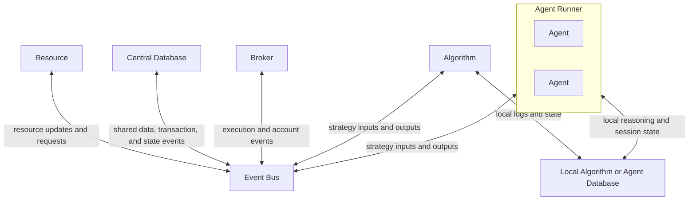
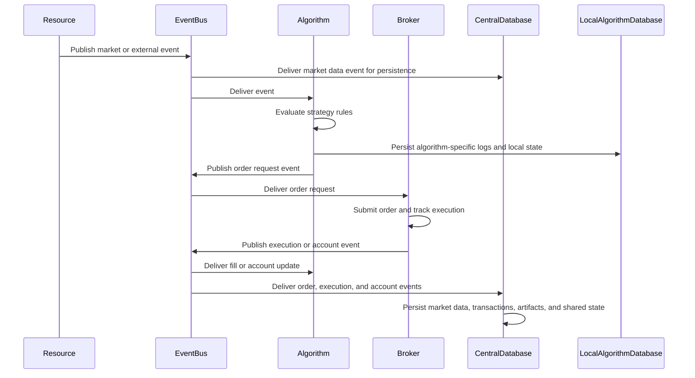
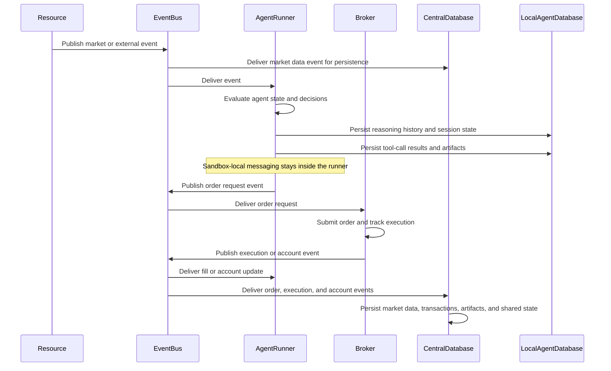

# Architecture

## Overview

Harvest is a trading framework with two architectural paths that currently coexist:

1. The legacy runtime built around `BrokerHub` in `harvest/trader/trader.py`.
2. The newer service-oriented runtime built around `Orchestrator` in `harvest/orchestrator.py`.

New work should generally prefer the orchestrator and service path unless the task is specifically about compatibility with the legacy runtime.

## Core Domains

## Target Architecture Diagram

The current repository is still in transition, but the intended direction is an event-driven architecture centered on shared infrastructure boundaries.

In this model:

- `Resource`, `Central Database`, `Broker`, `Algorithm`, and `Agent Runner` all connect to the `Event Bus` as first-class peers.
- The `Event Bus` is the primary transport backbone rather than a secondary integration path.

- `Resource` is the generalized upstream provider boundary for market data, research feeds, external APIs, and similar inputs.
- `Central Database` represents shared persistent state, market-data history, transaction or execution records, and other shared artifacts.
- `Local Algorithm or Agent Database` represents component-local state such as algorithm-specific logs, agent session data, reasoning history, or other local working records.
- `Broker` remains the execution-focused boundary for orders, positions, and account state.
- `Algorithm` is the deterministic decision boundary.
- `Agent Runner` is the sandbox and mediation layer that hosts one or more agents and exposes their framework-visible decisions.
- `Event Bus` is the transport backbone that decouples all of these components.

See also `agent.md` for the agent-local behavior boundary and `agent-runner.md` for the sandbox and coordination model.

### Algorithms

- `harvest/algorithm.py` contains the newer `Algorithm` abstraction.
- `harvest/algo.py` contains the legacy `BaseAlgo` abstraction that is still used by the CLI flow.
- Algorithms define deterministic decision logic.
- Behaviorally, an algorithm is basically a Python function that takes an input event, evaluates it, and either decides to perform a transaction or decides to do nothing.
- In the intended design, algorithms do not directly orchestrate brokers, storage, or system wiring. They consume inputs from the `Event Bus`, make a decision, and publish order or follow-up events back onto the bus.
- Market data, account updates, fills, and similar signals arrive through the event bus. Order requests and algorithm-generated signals also go back out through the event bus so the rest of the system can react in a decoupled way.
- In that sense, `Algorithm` and `Agent Runner` are behaviorally similar: both receive inputs, process them, and make decisions. The main difference is that `Algorithm` is intended for deterministic strategy logic, while `Agent Runner` hosts agent-driven decision logic.

### Traditional Algorithm Order Flow

The following sequence shows the intended non-agent path for a typical algorithmic trade decision.

In that flow:

- `Resource` provides the upstream input event, and those market-data events are also persisted to the central database.
- `Algorithm` receives the input event, evaluates it, and decides whether to place a transaction or do nothing.
- `Broker` is the execution boundary that turns order requests into live broker operations.
- `Central Database` persists shared market data and transaction or execution history.
- `Local Algorithm Database` stores algorithm-specific logs and local working state.
- `Event Bus` remains the integration layer for both inbound data and outbound orders.

### Agent Runner

- `Agent Runner` is the sandbox boundary for one or more agents.
- Behaviorally, it follows the same high-level shape as an algorithm: it receives an input, does something with it, and decides whether to emit a transaction or another event.
- It receives framework events from the `Event Bus`, translates them into agent-facing inputs, and publishes only framework-visible outcomes back onto the bus.
- Unlike the traditional algorithm path, the intended agent-runner design also persists agent-specific runtime artifacts such as reasoning-chain history, tool-call results, and session history to the database.
- See `agent-runner.md` for the more detailed sandbox model, including the sandbox-local event bus concept.

### Agent Runner Order Flow

The following sequence shows the intended agent-runner path, including persistence of agent-runtime artifacts.

In that flow:

- `Agent Runner` hosts the sandbox but does not own the agent's thinking loop; the agent itself owns execution.
- `Sandbox-local` messages stay inside the runner unless they are explicitly promoted as system-level events.
- `Central Database` persists shared market data, transaction history, and other framework-visible records.
- `Local Agent Database` persists agent-runtime artifacts such as reasoning history, tool-call results, and session state.
- This split allows later phases to add richer agent tracing, replay, and inspection features while keeping shared market and transaction data centralized.

### Brokers

- `harvest/broker/_base.py` defines the broker contract.
- Concrete implementations live under `harvest/broker/`.
- Brokers are responsible for market data access, order placement, account access, and broker-specific capabilities.

### Storage

- `harvest/storage/_base.py` defines local and central storage models.
- `LocalAlgorithmStorage` is algorithm-local.
- `CentralStorage` is shared storage for price history and account-level data.
- The intended storage split is that shared market data and broker transaction history live in central storage, while algorithm-specific or agent-specific logs and local session state live in local component storage.
- Duplication between local and central storage code is intentional and should not be removed casually.

### Services

- `harvest/services/` contains the newer service-oriented architecture.
- Key services include market data, broker access, algorithms, central storage, and service discovery.
- `Orchestrator` wires these services together and manages lifecycle.

### Events

- `harvest/events/event_bus.py` provides the event bus.
- `harvest/events/events.py` defines event payload types.
- The orchestrator path is event-driven and uses these abstractions to decouple components.

## Entry Points

### CLI

- The `harvest` console script points to `harvest.cli:main`.
- `harvest start` scans a directory for `BaseAlgo` subclasses and runs them through the legacy `BrokerHub` flow.
- This means the default CLI behavior is still tied more closely to legacy APIs than to the newer orchestrator path.

### Examples

- `examples/` contains the clearest examples of intended usage.
- `examples/orchestrator_example.py` is the best starting point for the service-oriented direction.

## Current Architectural Reality

The repo is not fully migrated to one runtime model.

- The legacy path is still user-visible via the CLI.
- The orchestrator path expresses the newer direction and should guide platform evolution.
- Some service-oriented pieces are present but not yet fully integrated across the whole project.

When making changes, state explicitly which of these you are affecting:

- Legacy `BrokerHub` runtime
- Service-oriented `Orchestrator` runtime
- Shared broker/storage/event abstractions used by both

## Stable Invariants

- Python 3.12 is the minimum supported version.
- UTC is the internal time standard.
- Domain data should be represented with typed structures rather than loose dictionaries when practical.
- Documentation and code should evolve together when architecture changes.

## Known Tensions

- The CLI still reflects older abstractions.
- The orchestrator path reflects newer architecture but is not the only active path.

Treat these tensions as normal project context, not as reasons to rewrite large portions of the codebase during unrelated tasks.
