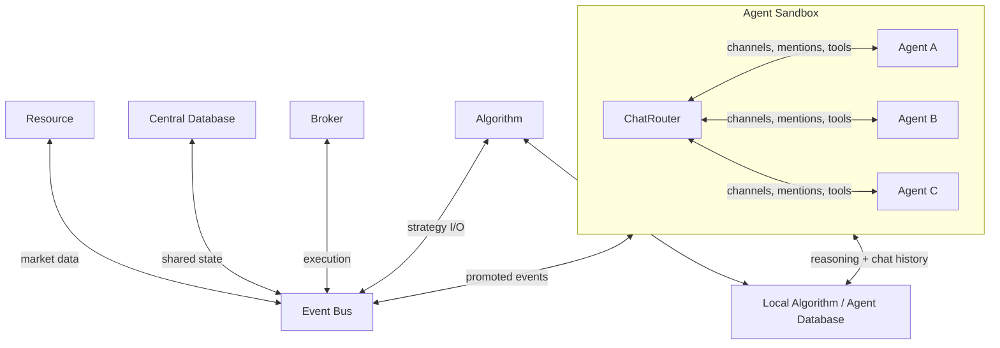

# Architecture Overview

Harvest is a trading framework with two runtime paths:

1. **Orchestrator** — event-driven service architecture for deterministic algorithmic trading (`harvest/orchestrator.py`)
2. **Agent Sandbox** — multi-agent runtime for LLM-driven decision-making (`harvest/agent_sandbox/`)

Both paths share the same broker, storage, event, and service abstractions.

## System Diagram

## Orchestrator Path

The orchestrator wires services together in an event-driven loop:

- **Resource** provides upstream data (market feeds, external APIs)
- **Algorithm** receives events, evaluates deterministic strategy logic, emits order events
- **Broker** executes orders, publishes fills and account state
- **Central Database** persists shared market data and transaction history
- **Event Bus** decouples all components

See `examples/orchestrator_example.py` for the canonical usage pattern.

## Agent Sandbox Path

The agent sandbox hosts multiple LLM-backed agents in a Slack-like collaboration environment:

- **BasicSandbox** — concrete sandbox with per-agent threading and hibernation loop
- **ChatRouter** — message routing with DM, group, and processor channels
- **Mention System** — `@here` and `@agent-name` conventions with notification modes
- **Hibernation** — jittered sleep/wake cycle with EventSources
- **YAML Manifest** — declarative sandbox definition
- **Policy System** — per-agent tool access and capability enforcement
- **Debug Monitor** — live WebSocket-based observation server with Slack-style frontend

Each subsystem is documented in its own file:

| Document | Scope |
|----------|-------|
| [sandbox.md](sandbox.md) | BasicSandbox hosting, threading, lifecycle |
| [chat-router.md](chat-router.md) | ChatRouter message routing and delivery |
| [channels.md](channels.md) | Channel types, mentions, notification modes |
| [hibernation.md](hibernation.md) | Hibernation loop and EventSources |
| [manifest.md](manifest.md) | YAML manifest format and loading |
| [policies.md](policies.md) | AgentPolicy, PolicyRegistry, child agents |
| [agent.md](agent.md) | HarvestAgent: LLM loop, tools, identity |
| [debug-monitor.md](debug-monitor.md) | Debug server, SvelteKit frontend |
| [cli.md](cli.md) | CLI commands reference |

## Shared Infrastructure

### Brokers

`harvest/broker/_base.py` defines the broker contract. Concrete implementations: Alpaca, Robinhood, Webull, Kraken, Polygon, Yahoo, Paper (simulated), Mock (testing).

### Storage

Two-tier storage model:

- **CentralStorage** — shared market data, broker transactions, account state
- **LocalStorage** — algorithm-specific logs or agent-specific reasoning/chat history

Key stores: `ChatStore` (agent messages), `ConversationStore` (LLM conversation history). Both use SQLAlchemy via `FlexibleStorage`.

### Events

`harvest/events/event_bus.py` provides the in-process event bus. `harvest/event_server.py` and `harvest/event_client.py` provide HTTP-based event distribution for cross-process use.

### Services

`harvest/services/` contains the service-oriented layer: market data, broker access, algorithms, central storage, and service discovery. The `Orchestrator` wires these together.

## Stable Invariants

- Python 3.12+ minimum
- UTC is the internal time standard
- Domain data uses dataclasses and enums, not loose dicts
- LiteLLM for model invocation (lightweight, no framework lock-in)
- Documentation and code evolve together
