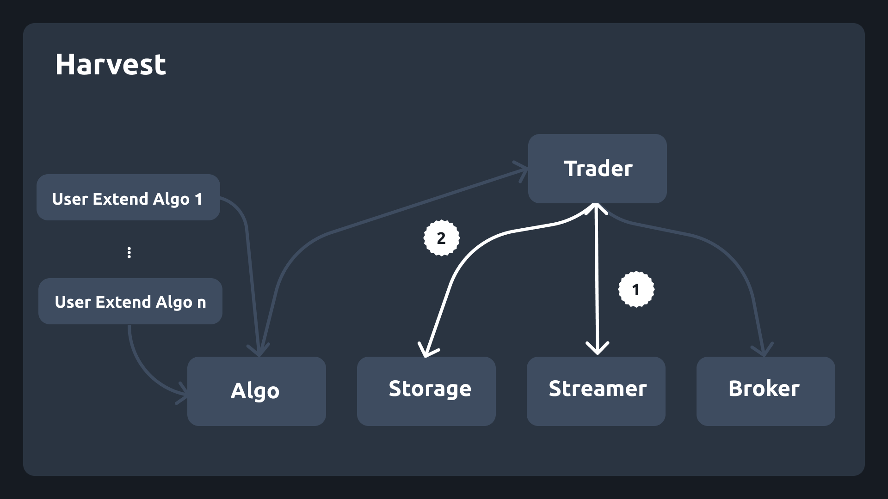
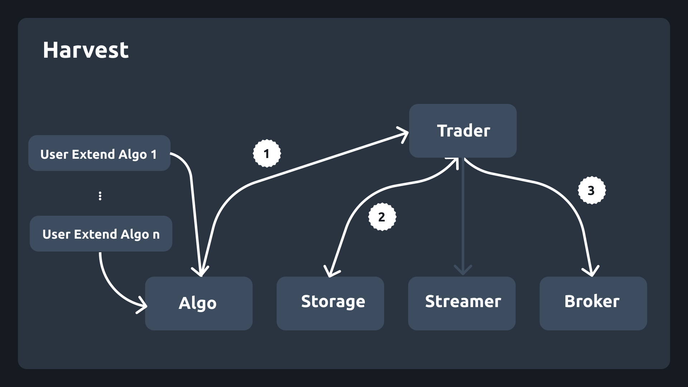

## The Harvest Workflow

Because Harvest is an extensive framework it can be hard to understand how the system works at times. This document server to provide a high-level overview of just how Harvests works after a user starts the trader.

### Main Loop

```python
trader.start()
streamer.start() # infinite loop
  streamer.main()
  trader.main()
  algo1.main()
  broker.fns()
  algo2.main()
  broker.fns()
```

## Fetching Data

After the user starts the trader Harvest will fetch data from the streamer and update its storage on interval.



1. First Harvest will run the streamer on the specified interval. Once the data has been collected, the streamer will call a callback or hook function that will pass operation back to the trader. In this callback function the streamer will return the latest OHLC data for the assets specified by the trader.
2. In this callback, the trader will update the storage with the latest data and the will run each algorithm.

## Running Algorithms

After data is fetched, the algorithms are run linearly.



1. The algorithm the user created will user functions provided in the `BaseAlgo` class which communicate with the Trader. 
2. Typically the user's algorithms will first ask for data on the assets they specified which will be stored in the Storage.
3. After that the user's algoirthms will decided when to buy or sell assets based on the data they got from the Storage. This will leverage the Broker.